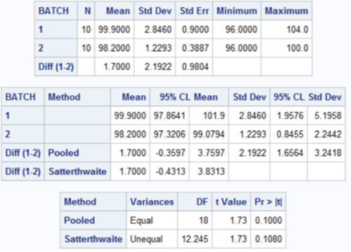
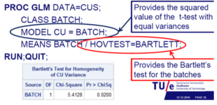
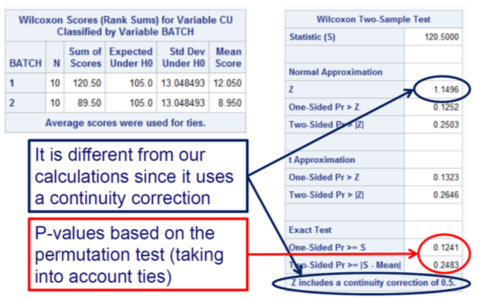
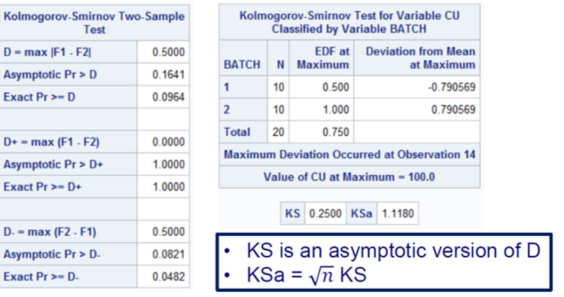

# Week 3: Two independent samples for continuos variables

1. [Motivation](#motivation)
2. [T-test](#ttest)
3. [Homogeneity of variance](#homvar)
    1. [F-test](#ftest)
    2. [Bartlett's test](#btest)
    3. [Levene's test](#ltest)
4. [Wilcoxon rank sum test](#wilcoxon)
5. [Mann-Whitney test](#mann)

## Motivation <a name="motivation"></a>

Consider outcome y_ij from group i=1,2 
Assume all observations are independent
Assume all observations in the same group are iid.
The null hypothesis is :   H_0  F_1 = F_2
Examples: Are the IQs of mathematicians and computer scientist the same?
                  Are the content uniformity of two sequential batches the same?
				  
## T-test <a name="ttest"></a>
In the case F_1 is normal  :   H0 : m_1 = m_2 (mew)  assuming equal variances
The optimal test is two-sample t-test with equal variances but it can be extended to a setting where variances are not necessarily equal
First test equal standard deviations and then use the appropriate t-test or always use the two-sample t-test with unequal variances.
Normal data with equal variances is optimal for T-test

```	PROC TTEST DATA=CUS; 
CLASS BATCH; 
VAR CU; 
RUN;
```

The batches have to be one next to the other. This command carries out both T-test and F-test



## Homogeneity of variance <a name="homvar"></a>
The null hypothesis is : H0 : s_1 = s_2
### F-test <a name="ftest"></a>
Under normality the optimal test is F-test:
           F = S1^2/S2^2           
The F-test is automatically calculated when the t-test is conducted in SAS
Same code for test

### Bartlett's test <a name="btest"></a>
An alternative for :   H0 : s1 = s2 that also uses the assumption of normality
Bartlett's test: also uses normality assumption
The advantage of Bartlett is that it can be extended to more than two groups
It may incorrectly reject homogeneity for non-normal data (highly sensitive)
Robust version of Bartlett is adjusted for kurtosis. (more robust against non-normal data)
If B is larger than the upper quantile of a chi-square distribution with 1 degrees of freedom the null hypothesis is rejected(see W2-2 page16 for details)

```	PROC GLM DATA=CUS; 
CLASS BATCH; 
MODEL CU = BATCH; 
MEANS BATCH / HOVTEST=BARTLETT;
RUN; QUIT;
```



### Levene's test <a name="ltest"></a>
An alternative test for  H0 : s1 = s2 (greek s) that does not require normality
It can easily be extended to more than just two independent samples

## Wilcoxon rank sum test <a name="wilcoxon"></a>
Described as a test for medians. Focus on both alternative hypothesis.
If the data is normal, t-test is more efficient. Otherwise, use Wilcoxon Rank Sum
If you are not completely sure about normality then use WRS test.
Assumptions:
-Each sample has been randomly collected from the population it represents
-The two samples are independent of one another
-The original variable observed is a continuous random variable
-The underlying distributions from which the samples are derived are identical in shape (implies variance homogeneity ,is controversial and is not as strict )


``` PROC NPAR1WAY DATA=CUS; 
CLASS BATCH; 
VAR CU; 
EXACT WILCOXON; 
RUN; 
```


## Mann-Whitney test <a name="mann"></a>
Instead of using ranks, they initially counted how frequent the values from one group is below the values of the other group

The Mann-Whitney test statistic is equivalent with the Wilcoxon rank sum test  S2 = U + n2n2 + 1/2
 where U is Mann-Whitney statistic and S is Wilcoxon Rank Sum

Mann-Whitney test may show that variance homogeneity is less relevant 

(check kenans mann whitney)

## Kolmogorov-Smirnov <a name="kolmo"></a>
The two samples are independent
The outcomes are ordinal or numerical	

``` 
PROC NPAR1WAY DATA=CUS; 
CLASS BATCH; 
VAR CU; 
EXACT KS; 
RUN;
```
Delete KS if it takes too long

