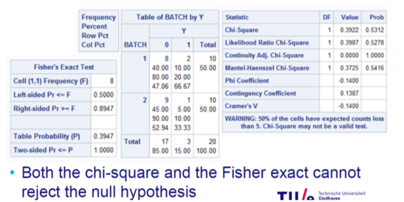

# Week 3: Two independent samples (binary)

1. [Motivation](#motivation)
2. [Overview](#overview)
3. [Notes](#notes)
4. [Chi-square for independence](#chi)
5. [Fisher exact test](#fisher)

## Motivation <a name="motivation"></a>
The outcome of the data is not always numerical, it can be binary, ordinal or nominal
In this case, a different test statistic is required

## Overview <a name="overview"></a>

## Notes <a name="Notes"></a>

## Chi-square test <a name="chi"></a>
The asymptotic test for difference in proportions is equal to Pearson’s chi-square test
Summarize the data in a 2x2 contingency table
Calculate the expected numbers for the contingency table when the null hypothesis is true
Compare the expected numbers with the observed numbers
Calculate the chi-square value and compare with the critical value 
The observed chi-square value is the asymptotic test squared 


P.S : Karl Persons suggestion 
Yates proposed a continuity correction for the chi-square test for small samples since the type I error is somewhat too large with xP2
The statistic is always less than Pearson’s chi-square statistic: xC2<=xP2
The correction has been controversial since it corrects the type I error somewhat too much. i.e. this makes the test conservative 
END PS. 

```
PROC FREQ DATA=CUS; 
TABLES BATCH*Y / CHISQ; 
RUN;
```
-The variable y is the binary outcome: y=1 indicates a content uniformity outside specification 
-The Fisher exact test is provided automatically when the option “chisq” is added 




## Fisher exact test <a name="fisher"></a>
An exact approach is based on the hypergeometric distribution
It describes the probability on each 2x2 table given the column and row totals 

Fisher exact test:
-Should be used for small samples sizes n<=20
-Is considered conservative and not by all statisticians recommended
