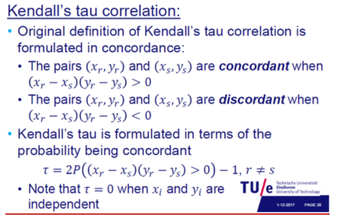

# Week 4: Dependence and Correlation

1. [Motivation](#motivation)
2. [Dependence definition](#dep)
3. [Correlation coefficients](#corr)
    1. [Pearson](#pearson)
    2. [Intraclass](#intra)
    3. [Phi](#phi)
    4. [Spearman](#spearman)
    5. [Kendall's Tau](#kendall)
4. [Copula](#copula)

## Motivation <a name="motivation"></a>


- Check below picture to pinpoint correlation coefficient and p-value


## Dependence definition <a name="dep"></a>

### Correlation coefficients <a name="corr"></a>


### Pearson <a name="pearson"></a>
Pearson Correlation is a measure of linear dependency
The correlation can be calculated for many types of distributions but the interpretation could be more difficult


Code:
```
PROC CORR DATA=GRADES PEARSON; 
VAR PRE EXAM; 
RUN;
```

### Intraclass <a name="intra"></a>

### Phi <a name="phi"></a>
phi coeeficient

```
PROC FREQ DATA=GRADES; 
TABLES B1*B2/CHISQ; 
RUN;
```
### Spearman <a name="spearman"></a>


```
PROC CORR DATA=GRADES SPEARMAN; 
VAR PRE EXAM; 
RUN;
```

### Kendall's Tau <a name="kendall"></a>



code:

```
PROC CORR DATA=GRADES KENDALL;
VAR PRE EXAM;
RUN;
```

Answers:


## Copula <a name="copula"></a>
For copulas see merged file slide 249

```
PROC CORR DATA = DATA_NAME KENDALL; *replace DATA_NAME;
	VAR VARIABLE_NAME1 VARIABLE_NAME2; *replace VARIABLE_NAME1 VARIABLE_NAME2;
RUN;

/*	take the tau coef from the table (check the second picture of file) */
/*	go to slide deck w3-2 slide 48, put tau in place to find alpha */
/*	go to slide 43-44 to check if that alpha is valid for that particular copula*/

DATA COPULA;
	tau = ; * insert tau here;
	fgm_alpha = 9*tau/2;
	clayton_alpha = 2*tau/(1-tau);
	gumbel_alpha = 1/(1-tau);
RUN;
```
