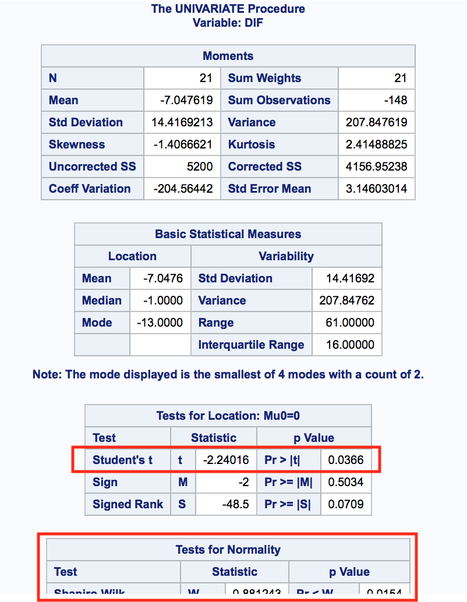
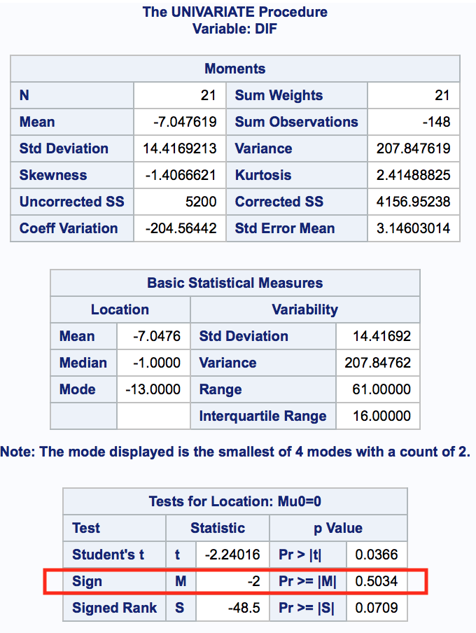
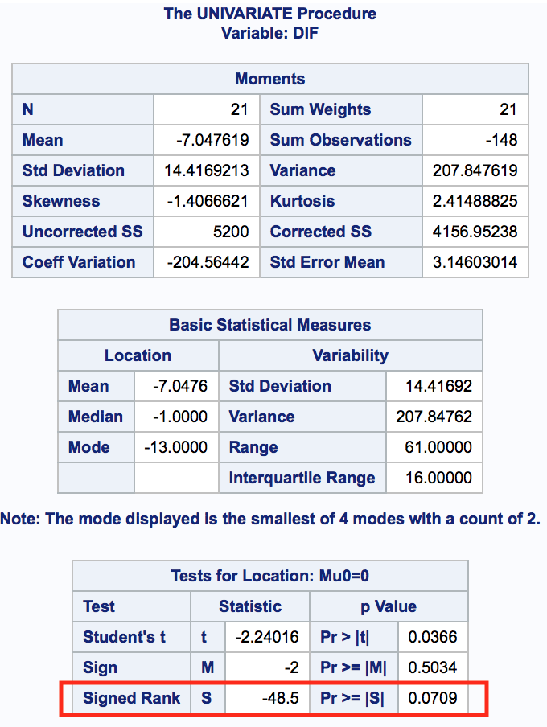
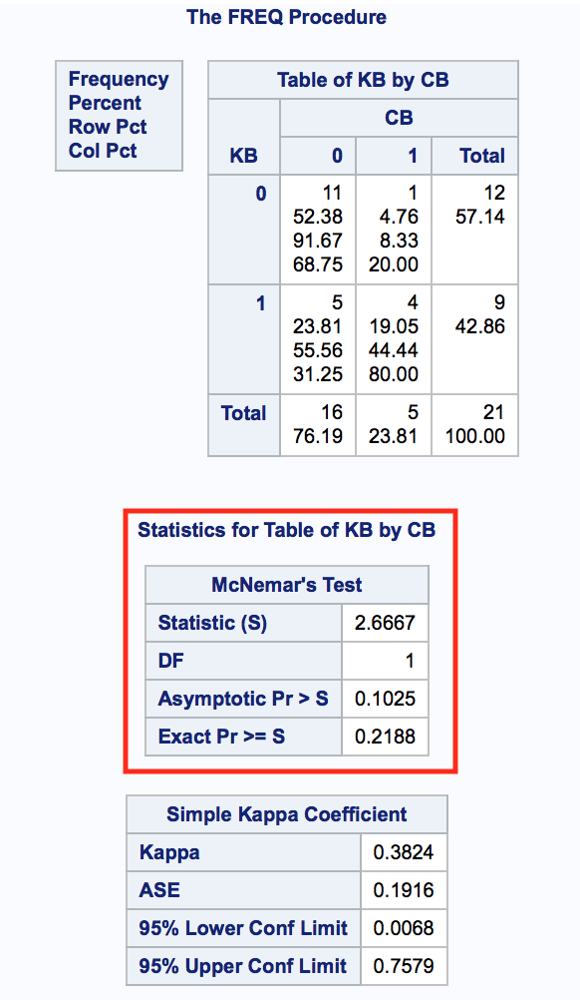
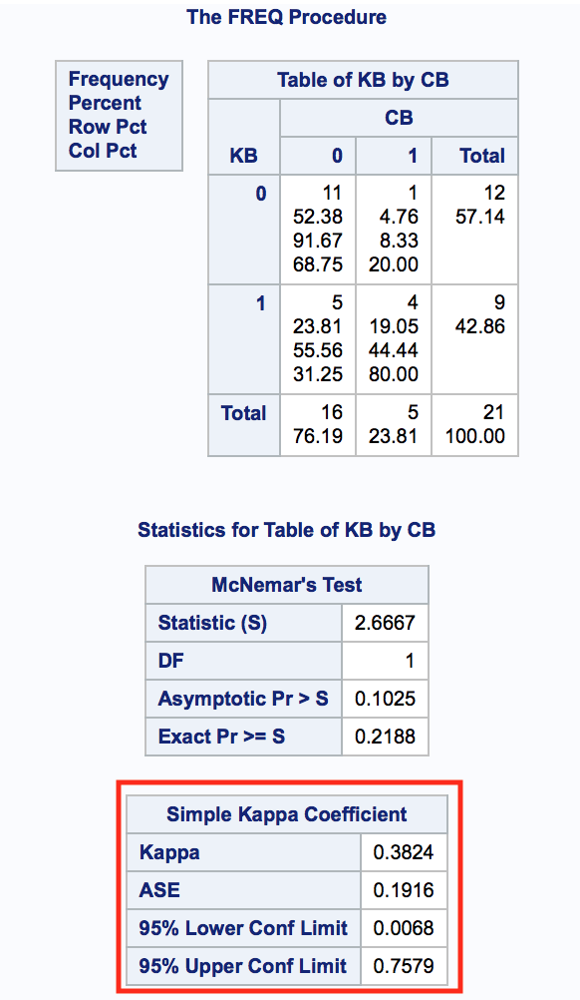

# Week 4: Paired samples

1. [Motivation](#motivation)
2. [Continuos variables](#cont)
    1. [Paired t-test](#ttest)
    2. [Sign test](#sign)
    3. [Wilcoxon signed rank test](#wilcoxon)
3. [Binary variables](#binary)
    1. [McNemar test](#mcnemar)
    2. [Kappa agreement](#kappa)

## Motivation <a name="motivation"></a>

To understand what paired data means let's think of the next example: One student can have a grade for the exam and a grade for the homework. We can then build the pair `Student <- (exam_grade, homework_grade)`. A paired sample is then a set of two measurement for the same "subject/person". What we want to answer with our tests for paired samples is _if the two measurements are following different distributions, meaning that something has made the measurements to change_. A naive but helpful interpreation for our example is: _has doing the homework made the students perform better in the exam?_ If so, then `homework_grade` even if very diverse for the students, made the `exam_grade` high almost for everyone (improved performance).

We DO NOT use tests for paired data when the two measurements come from different "subjects/persons", for that we use independence tests. Example: we DO NOT use these tests when we have measures for the `exam_grade` from students on different classses. 

The general null hyphotesis is: 

`H0: F1 = F2`

where:
- `F1` distribution of measurement A
- `F2` distribution of measurement B

For convinience, one of the next transformations is made to treat the two measurements as one (`(A, B) -> Z`). In this case, the tests try to prove that there are indeed not a "fair" measurement. 

- **Difference**: `Z = True_Measurement = M_B - M_A` (Sloppy interpratation: `Real distribution = F2 - F1`)
- **Log difference Difference**: `Z = True_Measurement = log(M_B) - log(M_A)`
- **Ratio**: `Z = True_Measurement = M_B / M_A` 

## Continuos variables <a name="cont"></a>

### Paired t-test <a name="ttest"></a>

It is based on the means of the two measurements.

#### Assumptions
- `Z` (the "true measurement") is normally distributed `N(mean, sigma^2)`

#### Null hypothesis (`H0`)

- Difference: `H0: mu_0 = 0` (Because by taking the difference, if they come from the same distribution, one would expect this difference to be 0)
- Log difference: `H0: mu_0 = 0` or `H0: meadian(measurementA) = median(measurementB)`
- Ratio: `H0: mu_0 = 1`  (Because by taking the ratio, if they come from the same distribution, one would expect the proportion to be 1)

#### Alternative hypothesis

`H1: F1 != F2` (each measurement comes from a different distribution) and then there was a change on the subjects/persons for the second measurement.

```
/* Variables to change:
    - my_dataset
    - id_of_dataset: the subject/person/observation id of the datset
    - measurementB: your variable B
    - measurementA: your variable A
*/

/* CHANGE my_dataset AND id_of_dataset HERE */
PROC SORT DATA = my_dataset;
    BY id_of_dataset;
RUN;

/* CHANGE my_dataset, measurementB AND measurementA HERE.*/
DATA my_dataset;
    SET my_dataset;
    /* Pick just one of the below options */
    DIFF  = measurementB - measurementA;
    *RATIO = measurementB/measurementA - 1; /* Sas tests for mu = 0 all time */
    *LOG_DIFF = LOG(measurementB)- LOG(measurementA);
RUN;

/* CHANGE my_dataset AND PICK AN OPTION DIFF/RATIO/LOG_DIFF HERE */
PROC UNIVARIATE DATA = my_dataset NORMAL;
    /* Pick just one of the below options */
    VAR DIFF;
    *VAR RATIO;
    *VAR LOG_DIFF;
RUN;

/* Recall to check for normality to give a conclusion. If DIFF/RATIO/LOG_DIFF
   is not normal, then we can not be sure about our t-test result.
*/
```



### Sign test <a name="sign"></a>

It is based on the medians of the two measurements [does not use the `Z` (the "true" measurement)]

#### Assumptions
- No distributional assumptions (distribution free)

#### Null hypothesis (`H0`)

- Difference: `H0: median(measurementA) = median(measurementB)`

#### Alternative hypothesis

`H1: F1 != F2` (each measurement come from a different distribution) and then there was a change on the subjects/persons for the second measurment.


#### Code

```
/* Variables to change:
    - my_dataset
    - id_of_dataset: the subject/person/observation id of the datset
    - measurementB: your variable B
    - measurementA: your variable A
*/

/* CHANGE my_dataset AND id_of_dataset HERE */
PROC SORT DATA = my_dataset;
    BY id_of_dataset;
RUN;

/* CHANGE my_dataset, measurementB AND measurementA HERE.*/
DATA my_dataset;
    SET my_dataset;
    /* Pick just one of the below options */
    DIFF  = measurementB - measurementA;
    *RATIO = measurementB/measurementA - 1; /* Sas tests for mu = 0 all time */
    *LOG_DIFF = LOG(measurementB)- LOG(measurementA);
RUN;

/* CHANGE my_dataset AND PICK AN OPTION DIFF/RATIO/LOG_DIFF HERE */
PROC UNIVARIATE DATA = my_dataset NORMAL;
    /* Pick just one of the below options */
    VAR DIFF;
    *VAR RATIO;
    *VAR LOG_DIFF;
RUN;
```




### Wilcoxon signed rank test <a name="wilcoxon"></a>

While Sign test does not use the `z` ("true" measurement), Wilcoxon DOES. 
It can handle ties.

#### Assumptions
- `z` follows a symetric distribution (example: normal has a symmetric shape)

#### Null hypothesis (`H0`)

- Difference: `H0: median(measurementA) = median(measurementB)`

#### Alternative hypothesis

`H1: F1 != F2` (each measurement come from a different distribution) and then there was a change on the subjects/persons for the second measurment.

#### Code

```
/* Variables to change:
    - my_dataset
    - id_of_dataset: the subject/person/observation id of the datset
    - measurementB: your variable B
    - measurementA: your variable A
*/

/* CHANGE my_dataset AND id_of_dataset HERE */
PROC SORT DATA = my_dataset;
    BY id_of_dataset;
RUN;

/* CHANGE my_dataset, measurementB AND measurementA HERE.*/
DATA my_dataset;
    SET my_dataset;
    /* Pick just one of the below options */
    DIFF  = measurementB - measurementA;
    *RATIO = measurementB/measurementA - 1; /* Sas tests for mu = 0 all time */
    *LOG_DIFF = LOG(measurementB)- LOG(measurementA);
RUN;

/* CHANGE my_dataset AND PICK AN OPTION DIFF/RATIO/LOG_DIFF HERE */
PROC UNIVARIATE DATA = my_dataset NORMAL;
    /* Pick just one of the below options */
    VAR DIFF;
    *VAR RATIO;
    *VAR LOG_DIFF;
RUN;
```



## Binary variables <a name="binary"></a>

### McNemar test <a name="mcnemar"></a>

It uses a contigency table to describe the data. 

#### Assumptions
- `measurementA` and `measurementB` are binary

#### Null hypothesis (`H0`)

- `H0: proportion_of_1_in_measurementA = proportion_of_1_in_measurementB` (This is known as _Marginal homogeneity_)

#### Alternative hypothesis

`H1: F1 != F2` (each measurement come from a different distribution) and then there was a change on the subjects/persons for the second measurement.

#### Code
```
/* CHANGE my_dataset AND id_of_dataset HERE */
PROC SORT DATA = my_dataset;
    BY id_of_dataset;
RUN;

PROC FREQ DATA = my_dataset;
    TABLES measurementA * measurementB / AGREE; 
    EXACT MCNEM;
RUN;
```



### Kappa agreement <a name="kappa"></a>

- It measures how well the measurements agree within each other.
- It is not recommended for datasets where we have "rare" events (infrequent observations) nor "non-events" (missing values)
- It is interpreted as next:

| Interpretation | Range         |
| -------------- |:-------------:|
| High agreement | (0.80, 1]     |
| Substantial    | (0.60, 0.80]  |
| Moderate       | (0.40, 0.60]  |
| Fair           | (0.20, 0.40]  |
| Poor           | (0, 0.20]     |

If a negative value is found, it means that the values are negatively associated. If that happens, mention that, but respect the range of interpretation.


#### Code
```
/* CHANGE my_dataset AND id_of_dataset HERE */
PROC SORT DATA = my_dataset;
    BY id_of_dataset;
RUN;

PROC FREQ DATA = my_dataset;
    TABLES measurementA * measurementB / AGREE; 
    EXACT MCNEM; /* Computes exact p-value */
RUN;
```


