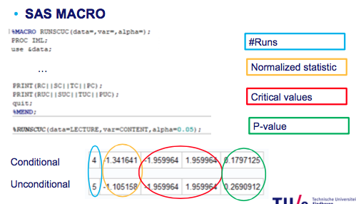

# Week 5: Randomness

1. [Motivation](#motivation)
2. [Definition](#graph)
3. [Conditional (median) runs test](#conditional)
	1. [Continuous variables](#cts)
	2. [Binary variables](#binary)
4. [Unconditional (serial) runs test](#unconditional)
5. [Code for conditional and unconditional](#code)
6. [Rank serial correlation](#serial)
7. [Normal autocorrelation](#autocor)

## Motivation <a name="motivation"></a>
- This is a stand alone topic within the course. The objective is, given a set of sequential data points we would like to understand if these are randomly sequenced or not. Simple as that. 

## Conditional (median) runs test <a name="conditional"></a>
- Run is defined as the same number occuring after another. Example: 0 0 1 1 (2 runs), 0 0 1 1 0 0 0 1 (4 runs)

## Continuous variables <a name="cts"></a>
- Convert the variables into binary by comparing them with the median. Data points larger than median become 1 and others 0. This done automatically with the code below.

## Binary variables <a name="binary"></a>
- The main idea of the test is that, to understand how likely it is to observe consecutive variables being larger or smaller than median. Define number of data points larger than median as `n1` and smaller than median `n2`, note that you can actually calculate all the possible permutations of the data points and also calculate how likely your case is.

## Unconditional (serial) runs test <a name="unconditional"></a>
- Continuous data points converted to binary variables by simply checking if the next value is greater than the previous data point. Binary variables stay as they are. This is automatically done by the below code. Example:  2 10 3 20 30 turns into 1 0 1 1. Once you have the binary variables, again permutations are calculated to see how likely this particular case is.

## Code for conditional and unconditional <a name="code"></a>
- Check slide 22 of W5-2 to interpret the resulting table of the code below
- This is how to interpret the macro result.



```
%MACRO RUNSCUC(data=,var=,alpha=); *dont change this line go to the end of the code;
PROC IML;
use &data;
read all var {&var};
close &data;

X=&var;
n=nROW(X);
MED=median(X);

XC=X;
DO i=1 to n by 1;
	IF (XC[i] >= MED) then XC[i]=1;
	ELSE XC[i]=0;
END;

n1C=sum(XC);
n2C=n-n1C;

RC=1;
DO i=2 to n by 1;
	if(XC[i] ^= XC[i-1]) then RC=RC+1;
END;

MUC=1+(2*n1C*n2C)/(n1C+n2C);
VARC=2*n1C*n2C*(2*n1C*n2C-n1C-n2C)/((n1C+n2C-1)*(n1C+n2C)**2);

SC=(RC-MUC)/SQRT(VARC);
TC=QUANTILE('NORMAL',&alpha/2);
TCU=QUANTILE('NORMAL',1-&alpha/2);
PC=(1-CDF('NORMAL',abs(SC)))*2;

XUC=REPEAT(0,n-1,1);
DO i=1 to (n-1) by 1;
	IF (X[i+1] > X[i]) then XUC[i]=1;
	IF (X[i+1] < X[i]) then XUC[i]=0;
	IF (X[i+1] = X[i]) then print("TIES");
END;

RUC=1;
DO i=2 to (n-1) by 1;
	if(XUC[i] ^= XUC[i-1]) then RUC=RUC+1;
END;

MUUC=(2*n-1)/3;
VARUC=(16*n-29)/90;

SUC=(RUC-MUUC)/SQRT(VARUC);
TUC=QUANTILE('NORMAL',&alpha/2);
TUCU=QUANTILE('NORMAL',1-&alpha/2);
PUC=(1-CDF('NORMAL',abs(SUC)))*2;

PRINT(RC||SC||TC||TCU||PC);
PRINT(RUC||SUC||TUC||TUCU||PUC);
quit;
%MEND;

* insert data, variable and alpha below. default alpha=0.05;
%RUNSCUC(data= ,var= ,alpha=0.05);
```

## Rank serial correlation <a name="serial"></a>
- Kenan did not understand how to extract p-value here. Apparently no one did.
- In the last table of results, you will see the `STAT`, that is your test statistic
```
* ATTENTION! YOU NEED TO CHANGE 4 LINES IN TOTAL;

Title 'Serial correlation';
PROC RANK DATA=DATA_NAME OUT=RANKS; *replace DATA_NAME;
	VAR VARIABLE_NAME; *replace VARIABLE_NAME;
	RANKS R;
RUN;

DATA RANKS;
	SET RANKS;
	R1 = LAG1(R);
RUN;

PROC MEANS DATA=RANKS MEAN;
	VAR R;
RUN;

*run until here;
*replace MEAN_RANK with the above result;;

DATA RANKS;
	SET RANKS;
	Z = R - MEAN_RANK; 
	Z1= R1 - MEAN_RANK;
	COV = Z*Z1;
RUN;

*ods rtf file='temp.rtf';
PROC MEANS DATA=RANKS SUM CSS;
	VAR COV R;
	OUTPUT OUT=SERIAL SUM(COV)=SUMCOV CSS(COV)=CSSCOV SUM(R)=SUMR CSS(R)=CSSR; 
RUN;
*ods rtf close;

DATA SERIAL;
	SET SERIAL;
	* replace NUMBER_OF_DATAPOINTS accordingly;
	N = NUMBER_OF_DATAPOINTS;
	ETA = SUMCOV/CSSR;
	MU  = -1/N;
	SIG = (5*n**4 - 24*n**3 + 29*n**2 + 54*n - 16)/(5*n**2*(n-1)**3 );
	STAT= (ETA - MU)/SQRT(SIG);
	C_Oneside= QUANTILE('NORMAL',1-0.05);
	C_Twoside= QUANTILE('NORMAL',1-0.05/2);
	KEEP ETA MU SIG STAT C_Oneside C_Twoside;
RUN;

*ods rtf file='temp.rtf';
PROC PRINT DATA=SERIAL;
RUN;
*ods rtf close;
```

## Normal autocorrelation <a name="autocor"></a>
- Kenan did not understand how to extract p-value here. Apparently no one did.
- In the last table of results, you will see the `STAT`, that is your test statistic 
```
* ATTENTION!!! A lot of replacement required here;

Title 'Autocorrelation';
DATA LAG;
	SET DATA_NAME; *replace DATA_NAME;
	* BEWARE!! Now Y1 will be the lagged version of your variable keep this in mind!!!;
	Y1 = LAG1(VARIABLE_NAME); *replace VARIABLE_NAME;
RUN;

PROC MEANS DATA=LAG MEAN;
	VAR VARIABLE_NAME;
RUN;

* first run until here, you need to make a replacement after that;

DATA LAG;
	SET LAG;
	* replace VAR_MEAN with the result of above codes and also VARIABLE_NAME;
	Z = VARIABLE_NAME  - VAR_MEAN;
	Z1= Y1 - VAR_MEAN;
	COV = Z*Z1;
RUN;

*ods rtf file='temp.rtf';
PROC MEANS DATA=LAG SUM CSS;
	* ATTENTION!!! Replace the 3 VARIABLE_NAME below;
	VAR COV VARIABLE_NAME;
	OUTPUT OUT=AUTOCOR SUM(COV)=SUMCOV CSS(COV)=CSSCOV SUM(VARIABLE_NAME)=SUMY CSS(VARIABLE_NAME)=CSSY; 
RUN;
*ods rtf close;

DATA AUTOCOR;
	SET AUTOCOR;
	N = NUMBER_OF_DATAPOINTS; *replace NUMBER_OF_DATAPOINTS;
	R = SUMCOV/CSSY;
	MU  = -1/N;
	SIG = (n-2)**2/(n**2*(n-1));
	STAT= (R - MU)/SQRT(SIG);
	C_Oneside= QUANTILE('NORMAL',1-0.05);
	C_Twoside= QUANTILE('NORMAL',1-0.05/2);
	KEEP R MU SIG STAT C_Oneside C_Twoside;
RUN;

*ods rtf file='temp.rtf';
PROC PRINT DATA=AUTOCOR;
RUN;
*ods rtf close;

```

